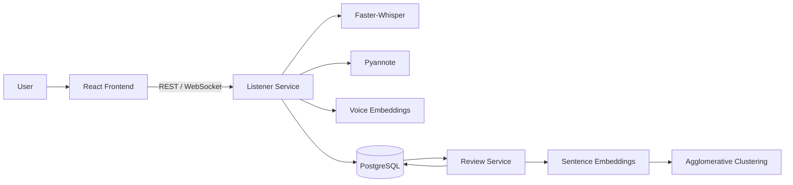
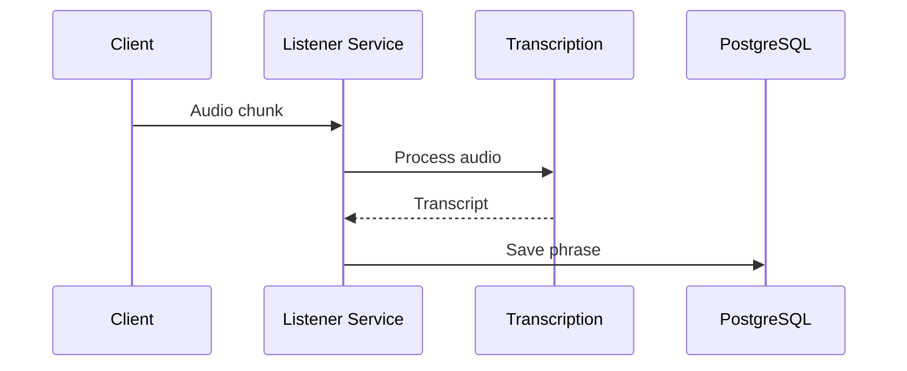
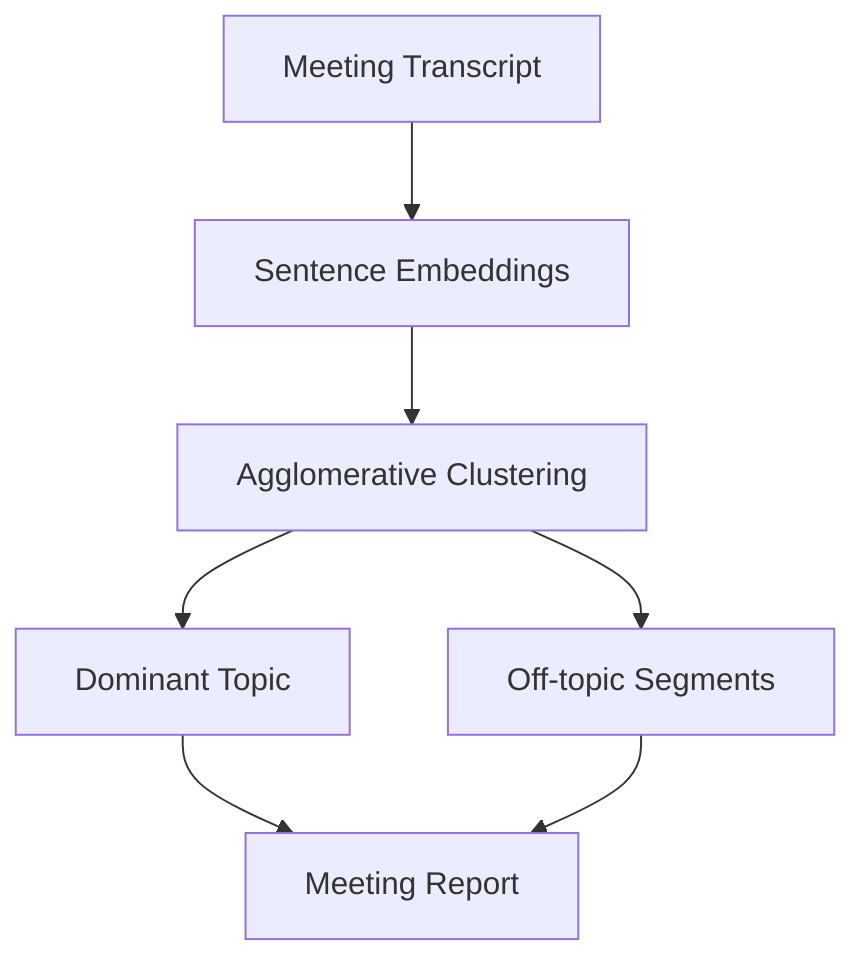

# Timeflow — AI Meeting Assistant

**ИИ-приложение для анализа и повышения эффективности онлайн-встреч.**

**Status: accelerator prototype**

Timeflow объединяет потоковую транскрибацию речи, диаризацию участников, идентификацию говорящих и анализ содержания встречи.

Прототип разработан командой из шести человек в рамках акселератора **«Ловушка для инноваций»**.

---

## Проблема

Во время онлайн-встреч участники часто сталкиваются с несколькими проблемами:

- важная информация теряется после окончания разговора;
- сложно восстановить, кто именно произнёс конкретную фразу;
- обсуждение может незаметно уходить от основной темы;
- ручное составление итогов встречи занимает дополнительное время;
- обычная транскрибация не даёт полноценного понимания структуры разговора.

Timeflow исследует подход, при котором AI используется не только для преобразования речи в текст, но и для анализа самой встречи.

---

## Возможности

В прототипе реализованы:

- создание и хранение онлайн-встреч;
- передача аудио через WebSocket;
- потоковая транскрибация русской речи;
- автоматическая обработка аудиофрагментов;
- offline speaker diarization;
- разделение транскрипта между различными говорящими;
- создание голосовых профилей пользователей;
- сохранение voice embeddings;
- сопоставление говорящих с известными пользователями;
- отслеживание соответствия разговора повестке;
- уведомления при существенном отклонении от темы;
- анализ встречи после её завершения;
- определение основной темы разговора;
- поиск off-topic фрагментов;
- статистика активности участников;
- хранение истории встреч в PostgreSQL;
- web-интерфейс приложения.

---

## Архитектура



Backend разделён на сервисы с отдельной ответственностью.

### Listener Service

Основной сервис работы со встречей.

Отвечает за:

- получение аудио;
- управление активными разговорами;
- транскрибацию;
- диаризацию;
- работу с голосовыми профилями;
- WebSocket-соединения;
- live monitoring встречи.

### Review Service

Выполняет анализ уже полученной транскрипции:

- преобразует реплики в semantic embeddings;
- группирует близкие по смыслу реплики;
- определяет доминирующую тему разговора;
- выделяет потенциально off-topic сегменты;
- считает статистику участников;
- сохраняет результаты анализа.

### PostgreSQL

Хранит:

- встречи;
- транскрибированные фразы;
- говорящих;
- пользователей;
- голосовые профили;
- voice embeddings;
- результаты анализа.

---

## Pipeline обработки встречи

### 1. Создание встречи

Создаётся новая conversation:

```text
Client
  ↓
Listener Service
  ↓
PostgreSQL
```

После создания клиент получает идентификатор встречи.

---

### 2. Потоковая передача аудио

Аудиоданные передаются в Listener Service через WebSocket:

```text
/ws/{conversation_id}
```



---

## Транскрибация

Для распознавания речи используется **Faster-Whisper**.

В локальной конфигурации используется модель:

```env
WHISPER_MODEL_SIZE=base
WHISPER_DEVICE=cpu
WHISPER_COMPUTE_TYPE=int8
```

Pipeline:

```text
Audio
 ↓
Normalization
 ↓
Voice Activity Detection
 ↓
Faster-Whisper
 ↓
Timestamped transcript
```

---

## Диаризация

После завершения встречи выполняется speaker diarization.

Для этого используется **Pyannote Audio**.

```text
Recorded audio
      ↓
Pyannote
      ↓
Speaker segments
      ↓
Speaker_0
Speaker_1
Speaker_2
```

Полученные временные интервалы сопоставляются с транскрибированными фразами, что позволяет определить, какому говорящему принадлежит каждая реплика.

---

## Voice profiles

Система поддерживает регистрацию эталонного голоса пользователя.

Для каждого голосового образца:

1. загружается аудиофайл;
2. аудио приводится к mono 16 kHz;
3. вычисляется voice embedding;
4. embedding сохраняется в профиль пользователя.

API:

```text
POST /enroll-voice
```

Упрощённая схема:

```text
Voice sample
    ↓
Normalization
    ↓
Voice Encoder
    ↓
Embedding
    ↓
Voice Profile
    ↓
PostgreSQL
```

Голосовые embeddings используются для сопоставления найденного в ходе диаризации спикера с известным пользователем.

---

## Контроль повестки в реальном времени

Timeflow содержит отдельный WebSocket-контур для live monitoring:

```text
/ws/live/{conversation_id}
```

В начале соединения клиент передаёт повестку встречи.

Во время разговора система отслеживает score соответствия текущего обсуждения заданной теме.

Если соответствие существенно падает, клиент может получить alert:

```json
{
  "type": "alert",
  "score": 0.48,
  "message": "Возможно, отошли от темы",
  "suggestion": "Вернемся к повестке?"
}
```

Для предотвращения большого количества повторяющихся сообщений используется cooldown между уведомлениями.

---

## Анализ встречи

После получения транскрипта Review Service выполняет семантический анализ реплик.



Каждая реплика преобразуется в embedding.

Затем используется **Agglomerative Clustering** для группировки семантически похожих высказываний.

Наиболее крупный кластер рассматривается как основная линия обсуждения, а реплики из других кластеров могут быть отмечены как отклонение от основной темы.

На основе анализа формируются:

- предполагаемая основная тема;
- список off-topic фрагментов;
- количество реплик;
- количество отклонений;
- статистика активности каждого говорящего.

---

## Технологии

### Backend

- Python
- FastAPI
- WebSocket
- SQLAlchemy

### Speech / Audio

- Faster-Whisper
- Pyannote Audio
- Resemblyzer
- WebRTC VAD
- Librosa
- Torch / Torchaudio

### NLP

- Sentence Transformers
- Scikit-learn
- Agglomerative Clustering
- semantic embeddings

### Database

- PostgreSQL

### Frontend

- React
- Vite

### Infrastructure

- Docker
- Docker Compose

---

## Структура проекта

```text
ai_advice/
├── backend/
│   ├── listener_service/
│   │   ├── models/
│   │   ├── services/
│   │   ├── utils/
│   │   ├── main.py
│   │   └── Dockerfile
│   │
│   ├── review_service/
│   │   ├── api/
│   │   ├── application/
│   │   ├── domain/
│   │   ├── infrastructure/
│   │   ├── migrations/
│   │   └── main.py
│   │
│   ├── auth_service/
│   └── docker-compose.yml
│
├── frontend/
├── landing/
└── README.md
```

---

## Локальный запуск

### Требования

- Docker;
- Docker Compose;
- Node.js и pnpm;
- Hugging Face token для загрузки моделей Pyannote.

Создайте `.env` в директории `backend`:

```env
HUGGINGFACE_TOKEN=<your-token>
```

После этого:

```bash
cd backend
docker compose up --build
```

Основные сервисы:

| Service | Port |
|---|---:|
| Listener Service | `8000` |
| Review Service | `8001` |
| PostgreSQL | `5432` |

После запуска документация Listener Service доступна через стандартный Swagger UI FastAPI.

---

## Frontend

```bash
cd frontend
pnpm install
pnpm dev
```

---

## Основные API endpoints

### Создание встречи

```http
POST /conversations/
```

### Получение встречи

```http
GET /conversations/{conversation_id}
```

### Завершение встречи

```http
POST /conversations/{conversation_id}/end
```

После завершения запускается offline diarization.

### Регистрация голосового профиля

```http
POST /enroll-voice
```

### Потоковое аудио

```text
WS /ws/{conversation_id}
```

### Live monitoring

```text
WS /ws/live/{conversation_id}
```

### Health check

```http
GET /health
```

### Статистика

```http
GET /stats
```

---

## Статус проекта

Timeflow создавался как акселерационный прототип ИИ-приложения для повышения эффективности онлайн-встреч.

Реализован основной технический pipeline:

```text
Streaming audio
      ↓
Transcription
      ↓
Speaker diarization
      ↓
Speaker identification
      ↓
Meeting transcript
      ↓
Semantic analysis
      ↓
Meeting analytics
```

Проект демонстрирует совместное использование speech-to-text, speaker diarization, voice embeddings, NLP и web-технологий в рамках одного приложения.

---

## Возможные направления развития

- полноценная система аутентификации;
- интеграция с сервисами видеоконференций;
- интеграция с календарями;
- улучшение real-time анализа повестки;
- автоматическое формирование итогового протокола;
- выделение action items;
- summary встречи через LLM;
- улучшение speaker identification;
- production-ready хранение аудиофайлов;
- CI/CD;
- автоматические тесты и observability.
